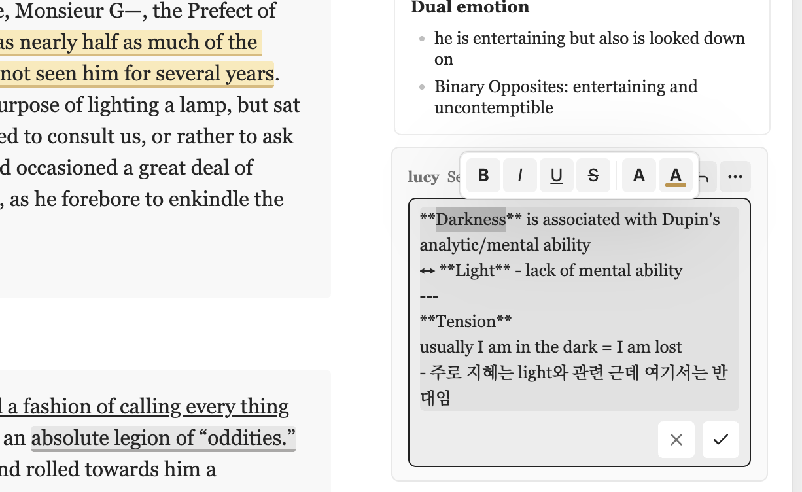
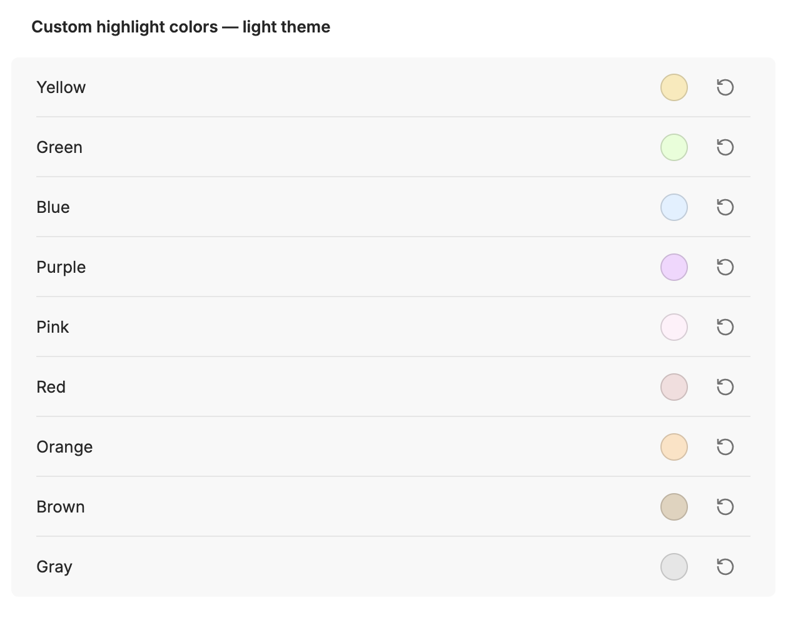
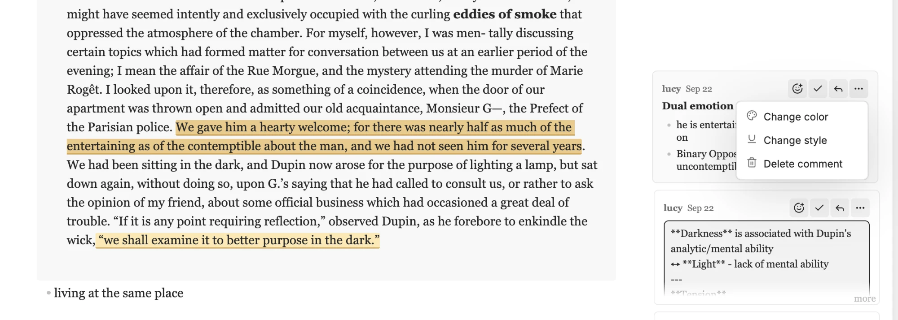
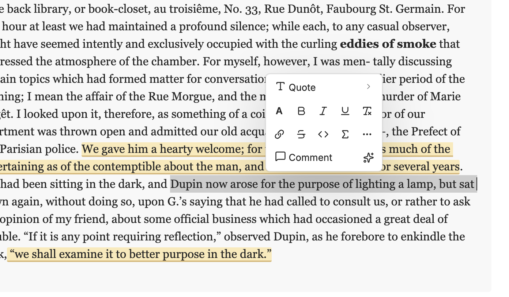
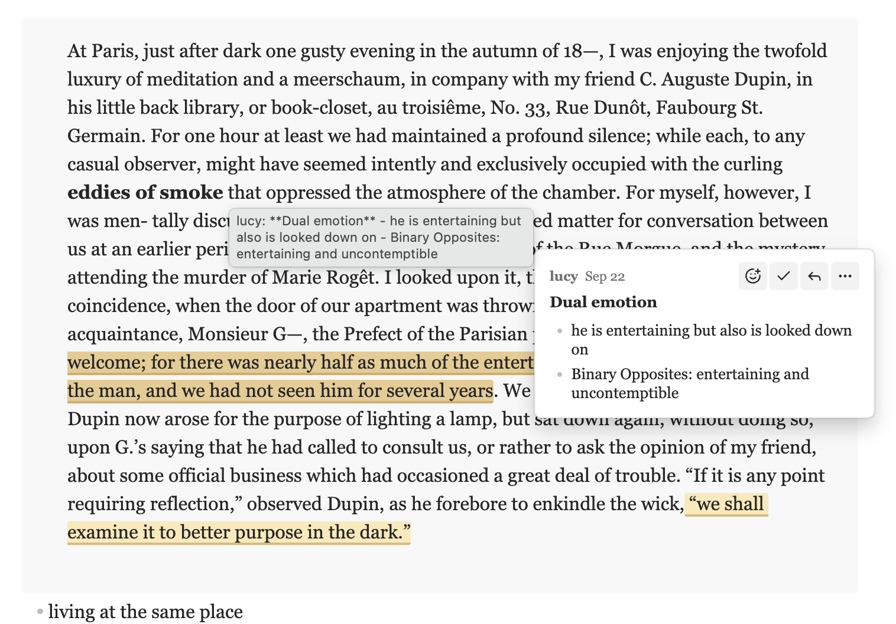

# Notion-style Comments

> This is a fork of [kylemcd/obsidian-document-comments](https://github.com/kylemcd/obsidian-document-comments) (**Document Comments**) by **Kyle McDonald**. All credit for the original plugin goes to the original author. This fork adds the features listed below. The original work is used under the MIT License; see [LICENSE](LICENSE).

Notion-style Comments adds inline comments to Obsidian notes. It shows each comment as a card beside the text on desktop.

If you like it, [](https://buymeacoffee.com/jiwooroh)

The plugin stores each comment inside its Markdown file as an HTML comment. Other editors, version control tools, and agents can read the comment.

## Check this out!
To use more features like Notion, check out [Notion-selection-toolbar](obsidian://show-plugin?id=notion-selection-toolbar) plugin


## What this fork adds

### Text formatting toolbar in comments

Select text while you write or edit a comment, and a small toolbar appears above the comment box:

- **B** / *I* / <u>U</u> / ~~S~~: bold, italic, underline, strikethrough
- Text color
- Highlight color



### Highlight colors

Choose how commented text is marked in your notes.

- **Highlight color**: theme default or one of 9 Notion-style colors (yellow, green, blue, purple, pink, red, orange, brown, gray).
- **Highlight intensity**: a slider that makes every color paler or bolder.
- **Custom colors**: pick your own hex value for each color, separately for light and dark themes.



### Underline style and per-comment overrides

- **Annotation style**: mark commented text with a filled highlight (the original look) or a quiet underline with no fill.
- Use a comment's **⋯** menu to change the color or style of that single comment.



### Comment from a selection toolbar

Pair this fork with [Notion Selection Toolbar](https://github.com/jiwooroh/notion-selection-toolbar), another plugin of mine. Select text in a note and choose **Comment** from its floating toolbar to start a comment.



If you don't use that plugin, turn on **Show floating button** in this plugin's settings. A small comment button then appears next to any text you select. It is off by default.

### Narrow window layout

When the window is too narrow for the margin, comment cards hide and appear when you hover over the highlighted text, so the note keeps its full width.



### Smaller touches

- Comment boxes grow as you type.
- Long comments are clamped with a "more" link.
- Click your own comment text to edit it.

## Original features

### Comments and storage

- Store comments inside Markdown files without a separate database.
- Add comments to prose, inline code, tables, and selected lines in fenced code blocks.
- Save an empty comment and highlight its selected text.
- Reply, resolve, reopen, edit, delete, or react to a comment.
- Write Markdown in comments, including links, lists, bold text, and code spans.
- Use the same notes on desktop and mobile.

### Views and controls

- Show comment cards in Live Preview, Source view, and Reading view.
- Open long comments in the sidebar.
- Filter the sidebar by open, resolved, or all comments.
- Hide all comments or hide resolved comments.

## Comment format

The plugin uses an anchor pair and a comment block:

```markdown
We should <!--c:k3f9-->ship on Friday<!--/c:k3f9--> regardless of the QA timeline.
<!--co:k3f9 by:kyle at:2026-06-17T10:00:00.000Z status:open quote:"ship on Friday"
kyle (2026-06-17T10:00:00.000Z): I thought we agreed Thursday?
sam (2026-06-17T10:05:00.000Z): Thursday is better for QA.
-->
```

The `<!--c:ID-->` and `<!--/c:ID-->` markers identify the selected text. The matching `<!--co:ID ...-->` block stores the comment thread.

Markdown renderers hide these HTML comments. Tools that read the source file can find each comment and its selected text.

Comments on fenced code blocks use the same format. The comment block also stores the selected line range and exact code text.

An empty comment uses the same markers. Its comment block has no thread lines:

```markdown
We should <!--c:h7k2-->ship on Friday<!--/c:h7k2--> regardless of the QA timeline.
<!--co:h7k2 by:kyle at:2026-06-17T10:00:00.000Z status:open quote:"ship on Friday"
-->
```

## Install

Notion-style Comments requires Obsidian 1.7.2 or newer. It supports desktop and mobile.

### Community plugins

Install it from Obsidian:

1. Open **Settings → Community plugins**.
2. Select **Browse**.
3. Search for **Notion-style Comments**.
4. Select **Install**.
5. Select **Enable**.

### BRAT

Use BRAT to install a pre-release build:

1. Install **BRAT** from Community plugins.
2. Enable **BRAT**.
3. Run **BRAT: Add a beta plugin for testing**.
4. Enter `jiwooroh/obsidian-document-comments`.
5. Enable **Notion-style Comments** in Community plugins.

BRAT installs the latest GitHub release and checks for updates.

### Manual install

1. Download `main.js`, `manifest.json`, and `styles.css` from the [latest release](https://github.com/jiwooroh/obsidian-document-comments/releases).
2. Copy the files to `<your-vault>/.obsidian/plugins/notion-style-comments/`.
3. Restart or reload Obsidian.
4. Enable **Notion-style Comments** in Community plugins.

Create the `notion-style-comments` directory if it does not exist.

### Build from source

```bash
git clone https://github.com/jiwooroh/obsidian-document-comments
cd obsidian-document-comments
npm install
npm run build
```

Copy or link `main.js`, `manifest.json`, and `styles.css` to `<your-vault>/.obsidian/plugins/notion-style-comments/`.

Then enable **Notion-style Comments** in Community plugins.

## Use the plugin

### Add a comment in an editing view

1. Select text or one or more lines in a fenced code block.
2. Run **Add comment** from the command palette or your configured editor menu.
3. Write the comment in the margin composer.
4. Press Enter to save the comment.

Press Shift+Enter to add a line break. On mobile, use the dialog to save the comment.

### Add an empty comment

Notion-style Comments disables empty comments by default.

1. Open **Settings → Notion-style Comments**.
2. Enable **Allow empty comments**.
3. Select text and run **Add comment**.
4. Leave the comment field empty.
5. Press Enter on desktop, or select **Empty comment** on mobile.

The plugin highlights the selected text and shows a comment card. The card shows **Empty** until you add text.

Select **Empty** to add the first comment text. Use the card menu to delete the empty comment.

You can also select all the highlighted text and run **Add comment** again. Write text to add the first comment. Submit the empty field to delete it.

When **Allow empty comments** is off, an empty field closes without a change.
Existing empty comments remain available. You can add text or delete them.

### Add the command to the right-click menu

The optional [Commander plugin](https://community.obsidian.md/plugins/cmdr) can add commands to the editor menu.

#### Install Commander

1. Install **Commander**.
2. Enable **Commander**.

#### Configure the editor menu

1. Open **Settings → Commander**.
2. Select **Editor Menu**.
3. Select **Add command**.
4. Search for `Notion-style Comments: Add comment`.
5. Select the command.
6. Choose an icon.

The command now appears at the bottom of the editor right-click menu. Select text before you use it.

### Add a comment in Reading view

1. Select text in the active note.
2. Run **Add comment in reading view**.
3. Write the comment.
4. Save the comment.

The Reading view command cannot add comments to embedded content.

### Manage a comment

Select a card to open its reply field. Hover over an entry to show its reaction, resolve, edit, and delete controls.

Use the **Open comments sidebar** command or ribbon icon to show all comments in the active note.

Use **Toggle comments** to show or hide all cards and highlights. Use **Toggle resolved comments** to show or hide resolved comments.

### Set the author

Open **Settings → Notion-style Comments**. Set **Author** to the name that the plugin adds to new comments.

The plugin uses `me` when the Author setting is empty.

## Desktop and mobile behavior

Desktop views show cards in a margin beside the note. The cards align with their selected text and avoid overlaps.

Mobile views show the highlights without a margin. Use the sidebar to read and manage comments.

Mobile uses a dialog for new comments. The stored comment format stays the same on all devices.

## Agent support

This repository includes an agent skill for the comment format:

```text
skills/document-comments/
```

The skill explains how to read and edit comments without damaging their markers. It also includes a validation script:

```bash
python3 skills/document-comments/scripts/validate_comments.py path/to/file.md
```

## Privacy

The plugin does not use the network, telemetry, or accounts. It stores all comment data in the note.

## Known limitations

- Reading view comments work best with plain text inside one paragraph.
- Reading view cannot add a comment to text inside an embed.
- Avoid overlapping comment anchors because comments on the same words can be difficult to manage.
- The sidebar shows an orphaned comment when no matching selected text remains.
- Live Preview table highlights require browser support for CSS Custom Highlight.

## Development

```bash
npm install
npm run dev
npm run build
npm run check
npm test
```

- `npm run dev` watches the source files and rebuilds `main.js`.
- `npm run build` checks types and creates a production bundle.
- `npm run check` checks formatting, lint rules, types, and tests.
- `npm test` runs the test suite.

### Release

Update `manifest.json`, `package.json`, `versions.json`, and `CHANGELOG.md` before a release.

Push a tag that exactly matches the version in `manifest.json`:

```bash
git tag 0.2.1
git push origin 0.2.1
```

Then create a GitHub release for that tag with `main.js`, `manifest.json`, and `styles.css` attached.

## License

Notion-style Comments uses the MIT License. See [LICENSE](LICENSE).
